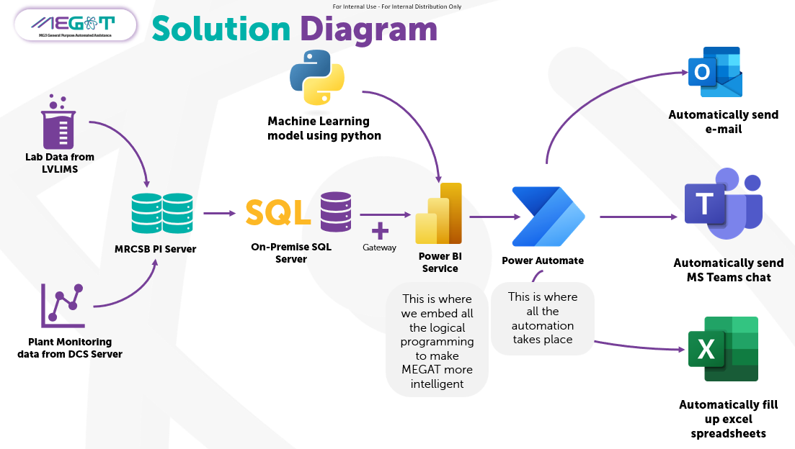

# MEGAT's AI Hub

## About Me

Hi, my name is Abu Huzaifah Bidin. I'm a process engineer with a passion for data and artificial intelligence. I'm currently working on building MEGAT, my AI assistance from scratch, envisioned to help me in day-to-day tasks as a process engineer. I hope that MEGAT soon can assist other process engineers out there.

[GitHub](https://github.com/maercaestro) | [Kaggle](https://www.kaggle.com/abuhuzaifahbidin) | [LinkedIn](https://www.linkedin.com/in/abu-huzaifah-bidin-71391068)

## What is MEGAT?

MEGAT is my comprehensive AI solution, designed to streamline and enhance my daily tasks as an operations engineer. Originally conceived as a solution to simplify and automate various processes, I began its development journey by leveraging tools like Microsoft Power Automate, along with basic JSON scripting and my foundational programming knowledge.

MEGAT was initially crafted to serve as a reliable assistant, aiding me in generating monthly, weekly, and daily reports efficiently. It also supports console operators in my units by providing them with timely instructions and pre-defined protocols, ultimately minimizing time-consuming tasks and optimizing productivity.

Over time, MEGAT has proven its effectiveness in simplifying complex workflows and enhancing operational efficiency. Its versatility and adaptability make it an indispensable asset in my professional toolkit, continually evolving to meet the dynamic demands of my role as an operations engineer.

I intend to expand MEGAT further by making it a fully realized generative AI. This GitHub Pages will serve as documentation on my journey to make MEGAT a fully realized Large Language Model (LLM). Additionally, I aim to equip MEGAT with the capability to process engineering data and serve as a viable alternative to first principle simulations like Hysys/Petrosim. This aligns with the proposed master's title, "Transformer-Based Approach for Modeling Base Oil Plant." Meanwhile, I also intend to develop incremental engineering solutions such as a PID extractor, RAG chatbot, and Peng Robinson calculator. Feel free to reach out to me if you have any ideas regarding the type of engineering solutions you would like to see.

## MEGAT's AI Journery
- [Siri Belajar AI: Buat RAG dari Kosong (Bahagian 1)](https://medium.com/@maercaestro/siri-belajar-ai-buat-rag-dari-kosong-bahagian-1-46d6acf201e8)
- [Siri Belajar AI: Buat RAG dari Kosong (Bahagian 2)](https://medium.com/@maercaestro/siri-belajar-ai-buat-rag-dari-kosong-bahagian-2-a41554905d37)
- [Siri Belajar AI: Buat RAG dari Kosong (Bahagian Akhir)](https://medium.com/@maercaestro/siri-belajar-ai-buat-rag-dari-kosong-bahagian-akhir-0cb63bffee64)
- [Siri Belajar AI: Apa itu Tokenization](https://medium.com/@maercaestro/siri-belajar-ai-apa-itu-tokenization-6e11104d8801)
- [Siri Belajar AI: Mari buat Jaringan Neural dari Kosong](https://medium.com/@maercaestro/siri-belajar-ai-mari-buat-jaringan-neural-dari-kosong-b525ba11171c)
- [Siri Belajar AI : Mari Belajar tentang Penanaman Posisi (Positional Embedding)](https://medium.com/@maercaestro/siri-belajar-ai-mari-belajar-tentang-penanaman-posisi-positional-embedding-94ad4cdd7cc2)

## MEGAT Engineering Repositories
- [MEGAT P&ID Extractor](https://github.com/maercaestro/pidextractor)
- [MEGAT ASTM to TBP Converter](https://github.com/maercaestro/astmconverter)
- [MEGAT Viscosity Calculator](https://github.com/maercaestro/megat-viscosity)
- [MEGAT Peng Robinson Calculator](https://github.com/maercaestro/megatpengrobinson)
- [MEGAT Tokenizer](https://github.com/maercaestro/megat-tokenizer)

## MEGAT Streamlit Apps
- [MEGAT ASTM Converter](https://megat-astmconverter.streamlit.app/)
- [MEGAT Peng Robinson Calculator](https://megatpengrobinson.streamlit.app/)
- [MEGAT P&ID Extractor](https://megat-pidextractor.streamlit.app/)

